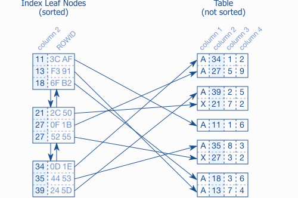
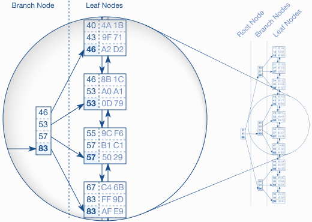

## SQL 索引剖析

*“索引让查询变快”*是我见过的对索引最基本的解释。尽管它很好地描述了索引的最重要方面，但不幸的是，它对于本书来说还不够。本章以不太肤浅的方式描述了索引结构，但没有深入到细节。它提供的洞察力足以让人理解本书中讨论的 SQL 性能方面。

索引是数据库中使用`create index`语句构建的独特结构。它需要自己的磁盘空间并保存索引表数据的副本。这意味着索引是纯粹的冗余。创建索引不会改变表数据；它只是创建一个引用表的新数据结构。毕竟，数据库索引非常像书末的索引：它占用自己的空间，高度冗余，并且指的是存储在不同位置的实际信息。

##### 聚簇索引（SQL Server、MySQL/InnoDB）

SQL Server 和 MySQL（使用 InnoDB）对“*索引*”的含义有更广泛的理解。它们将仅由索引结构组成的表称为*聚簇索引*。这些表在 Oracle 数据库中称为索引组织表 (IOT)。

[第 5 章，“*聚类数据*”](https://use-the-index-luke.com/sql/clustering)，更详细地描述了它们并解释了它们的优缺点。

在数据库索引中搜索就像在印刷的电话簿中搜索一样。关键概念是所有条目都按明确定义的顺序排列。在有序数据集中查找数据既快速又容易，因为排序顺序决定了每个条目的位置。

然而，数据库索引比印刷目录更复杂，因为它不断变化。为每个更改更新打印目录是不可能的，原因很简单，现有条目之间没有空间来添加新条目。打印的目录通过只处理下一次打印的累积更新来绕过这个问题。SQL 数据库不能等那么久。它必须立即处理`insert`,`delete`和`update`语句，在不移动大量数据的情况下保持索引顺序。

该数据库结合了两种数据结构来应对挑战：双向链表和搜索树。这两种结构解释了数据库的大部分性能特征。

内容：

1. *[叶节点](https://use-the-index-luke.com/sql/anatomy/the-leaf-nodes)*——双向链表
2. *[B-Tree——](https://use-the-index-luke.com/sql/anatomy/the-tree)*它是一棵平衡树
3. *[慢索引，第 I 部分](https://use-the-index-luke.com/sql/anatomy/slow-indexes)*— 两个因素使索引变慢

------

### 索引叶节点

索引的主要目的是提供索引数据的有序表示。但是，不可能按顺序存储数据，因为`insert`语句需要移动以下条目以为新条目腾出空间。移动大量数据非常耗时，所以`insert`语句会很慢。解决问题的方法是在内存中建立一个独立于物理顺序的逻辑顺序。

逻辑顺序是通过双向链表建立的。每个节点都有到两个相邻条目的链接，非常像一条链。通过更新它们的链接以引用新节点，在两个现有节点之间插入新节点。新节点的物理位置并不重要，因为双向链表维护逻辑顺序。

该数据结构称为双向链表，因为每个节点都引用前面和后面的节点。它使数据库能够根据需要向前或向后读取索引。因此可以在不移动大量数据的情况下插入新条目——它只需要更改一些指针。

双向链表也用于许多编程语言中的集合（容器）。

数据库使用双向链表来连接所谓的索引叶节点。每个叶节点存储在一个数据库块或页面中；即数据库的最小存储单元。所有索引块的大小都相同——通常为几千字节。数据库尽可能使用每个块中的空间，并在每个块中存储尽可能多的索引条目。这意味着索引顺序在两个不同的级别上维护：每个叶节点内的索引条目，以及使用双向链表相互连接的叶节点。

#### 图 1.1 索引叶子节点和对应的表数据

[图 1.1](https://use-the-index-luke.com/sql/anatomy/the-leaf-nodes#fig-LeafNodes)说明了索引叶节点及其与表数据的连接。每个索引条目都由索引列（键，第 2 列）组成，并引用相应的表行（通过`ROWID`或`RID`）。与索引不同，表数据存储在堆结构中，根本没有排序。存储在同一表块中的行之间既没有关系，块之间也没有任何连接。

### 搜索树（B-Tree）让索引变快

------

索引叶子节点以任意顺序存储——磁盘上的位置与索引顺序的逻辑位置不对应。它就像一个页面打乱的电话簿。如果您搜索“Smith”但首先打开位于“Robinson”的目录，则决不能认为 Smith 跟随 Robinson。数据库需要第二种结构来快速找到混洗页面中的条目：平衡搜索树——简而言之：B 树。

#### 图 1.2 B 树结构

[图 1.2](https://use-the-index-luke.com/sql/anatomy/the-tree#TreeNodes)显示了一个包含 30 个条目的示例索引。双向链表建立叶节点之间的逻辑顺序。根节点和分支节点支持叶节点间的快速查找。

该图突出显示了一个分支节点及其所引用的叶节点。每个分支节点条目对应于各自叶节点中的最大值。以第一个叶子节点为例：该节点中的最大值为46，存储在对应的分支节点表项中。其他叶子节点也是如此，所以最终分支节点的值为46、53、57和83。根据这个方案，建立一个分支层，直到所有的叶子节点都被一个分支节点覆盖.

下一层的构建方式类似，但位于第一个分支节点级别之上。重复该过程，直到所有键都适合单个节点，即*根节点*。该结构是一个*平衡的搜索树*，因为树的深度在每个位置都是相等的；根节点和叶节点之间的距离在任何地方都是相同的。

#### 笔记

B 树是平衡树，而不是二叉树。

创建后，数据库会自动维护索引。它将每个`insert`,`delete`和应用于`update`索引并保持树的平衡，从而导致写操作的维护开销。[第 8 章“*修改数据*”](https://use-the-index-luke.com/sql/dml)对此进行了更详细的解释。

#### 图 1.3 B 树遍历

[图 1.3](https://use-the-index-luke.com/sql/anatomy/the-tree#TreeTraversal)显示了一个索引片段来说明对键“57”的搜索。树遍历从左侧的根节点开始。每个条目都按升序处理，直到值大于或等于 (>=) 搜索项 (57)。图中是表项83，数据库按照对应分支节点的引用，重复这个过程，直到树遍历到一个叶节点。

#### 重要的

B 树使数据库能够快速找到叶节点。

树遍历是一种非常高效的操作——效率如此之高，以至于我将其称为*索引的第一动力*。它几乎可以立即运行——即使是在庞大的数据集上。这主要是因为树平衡，它允许以相同的步数访问所有元素，其次是因为树深度的对数增长。这意味着与叶节点的数量相比，树的深度增长非常缓慢。具有数百万条记录的真实世界索引的树深度为四或五。几乎看不到六层的树深。[“*对数可扩展性*”](https://use-the-index-luke.com/sql/anatomy/the-tree#sb-log)框对此进行了更详细的描述。

在数学中，给定底数的数字的对数是为了产生数字 [[维基百科](https://en.wikipedia.org/wiki/Logarithm)] 必须提高底数的幂或指数。

在搜索树中，基对应于每个分支节点的条目数和树深度的指数。[图 1.2](https://use-the-index-luke.com/sql/anatomy/the-tree#TreeNodes)中的示例索引每个节点最多包含四个条目，树深度为三。这意味着该索引最多可以容纳 64 (4 3 ) 个条目。如果它增长一级，它已经可以容纳 256 个条目 (4 4 )。每增加一个级别*，*索引条目的最大数量就会*翻两番*。对数反转此函数。因此，树深度为 log 4（索引条目数）。

| 树深 | 索引条目  |
| :--- | :-------- |
| 3个  | 64        |
| 4个  | 256       |
| 5个  | 1,024     |
| 6个  | 4,096     |
| 7    | 16,384    |
| 8个  | 65,536    |
| 9    | 262,144   |
| 10   | 1,048,576 |

对数增长使示例索引能够搜索具有十个树级别的一百万条记录，但真实世界的索引效率更高。影响树深度并因此影响查找性能的主要因素是每个树节点中的条目数。从数学上讲，这个数字对应于对数的基础。基越高，树越浅，遍历越快。

数据库最大程度地利用了这个概念，并将尽可能多的条目放入每个节点——通常是数百个。这意味着每个新的索引级别都支持一百倍以上的条目。

### 慢速索引，第一部分

尽管树遍历的效率很高，但在某些情况下，索引查找的速度并没有预期的那么快。这种矛盾长期助长了*“退化指数”*的神话。神话宣称索引重建是奇迹般的解决方案。[附录 B，“*神话目录*”](https://use-the-index-luke.com/sql/myth-directory)详细介绍了这个和其他神话。现在，您可以想当然地认为重建索引从长远来看不会提高性能。普通语句可能很慢的真正原因——即使在使用索引时——可以在前面几节的基础上解释。

慢速索引查找的第一个要素是叶节点链。再次考虑在[图 1.3](https://use-the-index-luke.com/sql/anatomy/the-tree#TreeTraversal)中搜索“57” 。索引中显然有两个匹配条目。至少有两个条目是相同的，更准确地说：下一个叶节点可能有“57”的更多条目。数据库*必须*读取下一个叶节点以查看是否还有更多匹配条目。这意味着索引查找不仅需要执行树遍历，还需要遵循叶节点链。

慢速索引查找的第二个因素是访问表。即使是单个叶节点也可能包含许多命中——通常是数百个。相应的表数据通常分散在许多表块中（参见[图 1.1，“*索引叶节点和相应的表数据*”](https://use-the-index-luke.com/sql/anatomy/the-leaf-nodes#fig-LeafNodes)）。这意味着每次命中都有一个额外的表访问。

一次索引查找需要三个步骤：（1）树遍历；(2)跟随叶节点链；(3) 取表数据。树遍历是唯一对访问块数（索引深度）有上限的步骤。其他两个步骤可能需要访问许多块——它们会导致索引查找速度变慢。

“慢速索引”神话的起源是误认为索引查找只是遍历树，因此认为慢速索引一定是由“损坏”或“不平衡”树引起的。事实上，您实际上可以询问大多数数据库它们如何使用索引。Oracle 数据库在这方面相当冗长，并且具有三个描述基本索引查找的不同操作：

- 索引唯一扫描

  仅执行`INDEX UNIQUE SCAN`树遍历。如果唯一约束确保搜索条件匹配不超过一个条目，则 Oracle 数据库使用此操作。

- 索引范围扫描

  执行`INDEX RANGE SCAN`树遍历*并*跟随叶节点链找到所有匹配的条目。如果多个条目可能匹配搜索条件，则这是回退操作。

- 通过索引 ROWID 访问表

  该`TABLE ACCESS BY INDEX ROWID`操作从表中检索行。此操作（通常）针对来自先前索引扫描操作的每个匹配记录执行。

重要的一点是 an`INDEX RANGE SCAN`可以潜在地读取索引的很大一部分。如果每一行都有一个表访问，即使使用索引，查询也会变慢。